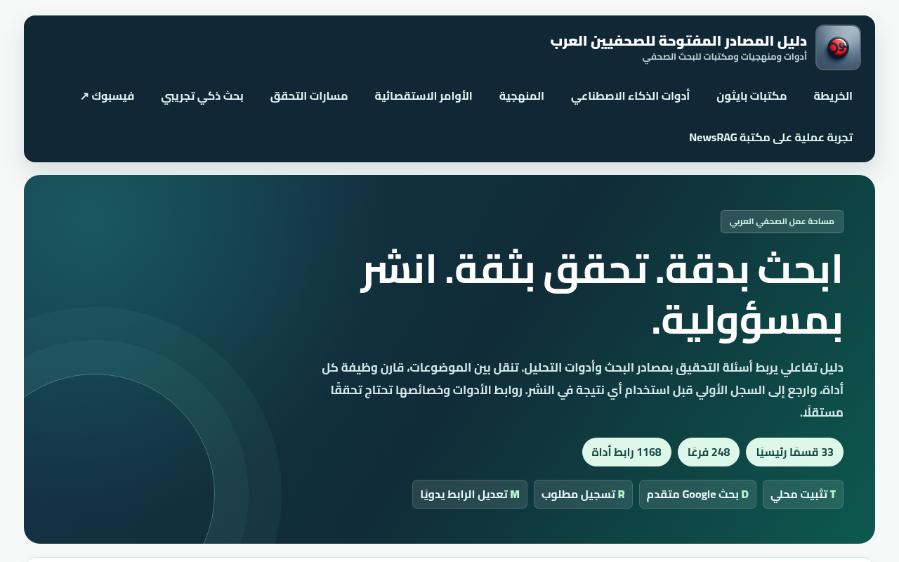
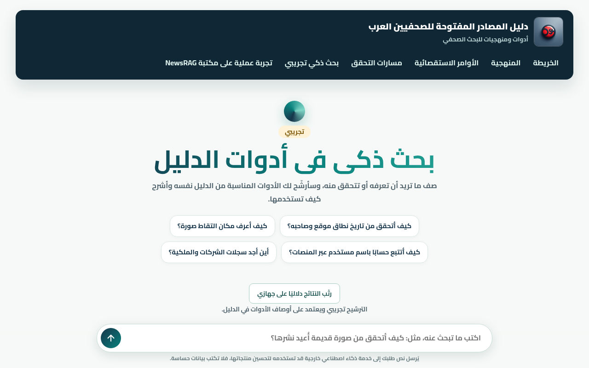
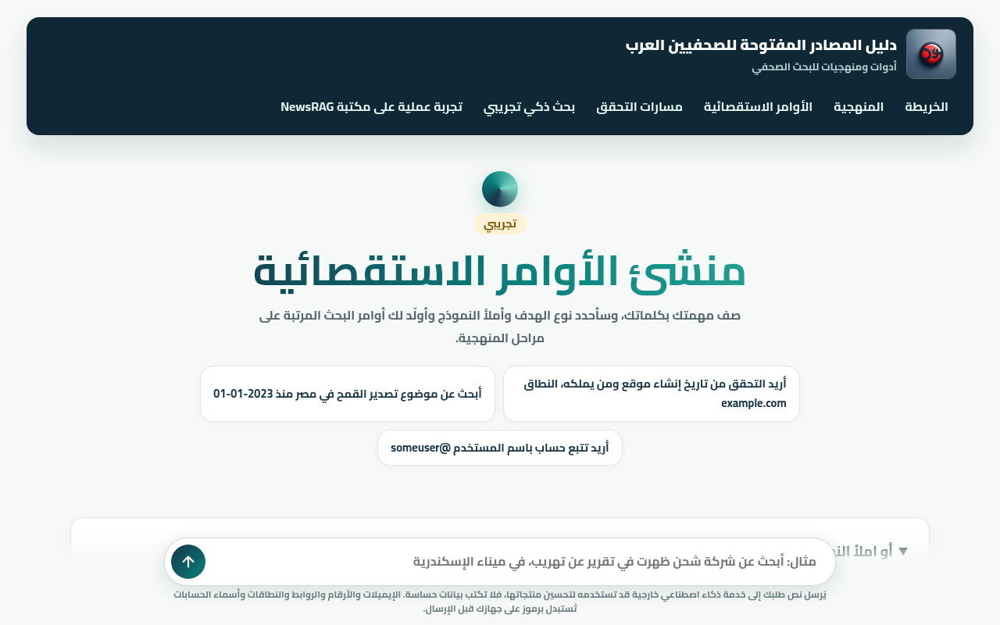
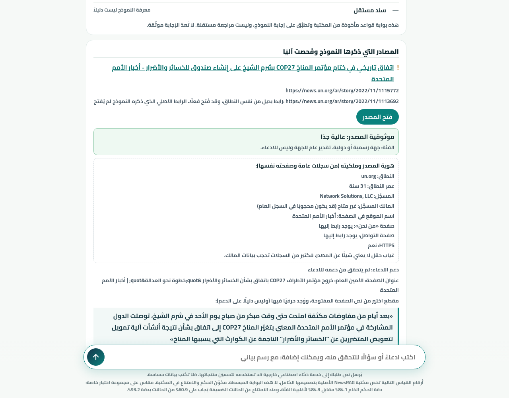

# Arabic Open-Source Sources Guide for Journalists

An interactive Arabic guide to open-source intelligence (OSINT) tools and sources, plus helper tools for verification: a source map, an investigative command builder, a smart search over the guide, and a claim-checking experiment that shows every result with its reasons and limits.

The site itself is fully in Arabic (right-to-left). This repository's documentation is in English.

- **Live site:** https://shehataelsayed.github.io/osint-arabic-sources/
- **Verification experiment:** https://shehataelsayed.github.io/osint-arabic-sources/rag.html



## What is on the site

| Page | What it does |
|---|---|
| [Home](https://shehataelsayed.github.io/osint-arabic-sources/) | Map of source and tool categories, analysis libraries and AI tools, with on-page search. |
| [Investigative commands](https://shehataelsayed.github.io/osint-arabic-sources/commands.html) | Turns an investigation goal into ready-made search commands for search engines and platforms, ordered by methodology stage. Commands are built in the browser. Describing the goal in words is optional; that text goes to an external AI service after emails, phone numbers and URLs are replaced with tokens. |
| [Smart search](https://shehataelsayed.github.io/osint-arabic-sources/smart-search.html) | Describe what you need and it recommends tools from the guide only. It may also show external web-search links, kept separate and marked as unchecked. |
| [Verification experiment](https://shehataelsayed.github.io/osint-arabic-sources/rag.html) | Enter a claim and get an answer with a confidence level, the sources that were actually opened, and quotes copied from those pages. |
| [Methodology](https://shehataelsayed.github.io/osint-arabic-sources/methodology.html) | The method, its limits and the licenses. |
| [Journalistic verification platform](https://shehataelsayed.github.io/osint-arabic-sources/verification.html) | Separate cases, tracks by content type, an evidence and source log, and a clear statement of how far a conclusion can go. |

| Smart search | Investigative commands |
|---|---|
|  |  |

## How the verification experiment works

It does not give a final ruling and never says a claim is "verified". It shows an answer, a confidence level and the reasons.

1. An external AI service is asked about the claim three times, then a fourth time to critique the answer. Only the claim text is sent, and the page shows a notice about it.
2. Every page the model cites is actually fetched. A link that does not open is shown as not opened, with no quote attached.
3. If a link fails, the Worker looks for a real page on the same domain (the site's sitemap first, then a domain-restricted search). Only a page that really opened is shown, labeled as an alternative link from the same domain, with the original link noted.
4. The Worker also searches the web for pages about the claim itself. They go through the same checks and are labeled as found by search, not by the model.
5. Sentences of each opened page are compared with the claim and the numbers are matched. A page counts as supporting only at similarity 0.4 or higher on a sentence of 6+ words with matching numbers. Shown quotes are verbatim sentences from the page, never text written by the model.
6. Each source gets a tier (official, news, academic, unknown) and the identity data that is available (domain age, registrar, HTTPS, About and contact pages). Missing fields show as "not available".
7. Confidence is **low** if any criterion fails, **medium** otherwise, and **high** only when a page from an official, news or academic source was opened and passed the check. A tier alone never raises confidence.



Details: [docs/how-verification-works.md](docs/how-verification-works.md).

### Honest limits

- The tool has not been evaluated on a set of claims with known truth, so no accuracy figure applies to it. The 84.1 and 93.2 figures belong to the original NewsRAG library, not to this tool.
- Model knowledge is not evidence. Evidence is what was found on an opened page and passed the check.
- The free service quota is limited. When it runs out the page says the service is busy.
- `validated_for_release` stays `false` in code and docs.
- No text from AFP, Misbar or AraFacts is copied. Fact-check items are a short snippet plus a link.

## Repository layout

```text
site/        Site source (HTML, JS, CSS)
data/        Analysis libraries and AI tools catalog
2-data.json  Source map and categories
worker/      Cloudflare Worker for verify / recommend modes
scripts/     Site build, search index, fact-check index
tests/       Python, Node and browser tests
docs/        Documentation
.github/     Deploy workflow and templates
```

More: [docs/structure.md](docs/structure.md).

## Run locally

Requires Node.js 22 and Python 3.12 or newer.

```sh
npm ci
npm run build          # creates _site and the Pagefind index
npm test               # Python and Node tests
npm run check:js       # syntax check
python3 -m http.server 8000 --directory _site
```

No ZIP file is used by the build. The ZIP files in the repository root are old archives.

## Deployment

The site deploys to GitHub Pages automatically when changes merge into `main` (`.github/workflows/deploy.yml`). The Worker is deployed separately. Steps and required secrets: [docs/deployment.md](docs/deployment.md).

## Contributing

Fixing links, suggesting sources and improving explanations are all welcome. Read [CONTRIBUTING.md](CONTRIBUTING.md) before opening a pull request.

## Link quality

`3-review-queue.json` is a review backlog, not a certificate that links work. The last check date is unknown for most links, and the inherited `live` status does not mean a recent check. A tool can appear under more than one branch, so the total number of entries is not the number of distinct tools.

## License and sources

Copyright © 2026 Shehata El-sayed. The scope of the license is in [LICENSE](LICENSE). Third-party material keeps its own licenses; see [THIRD_PARTY_NOTICES.md](THIRD_PARTY_NOTICES.md) and [docs/licenses.md](docs/licenses.md).

Design and development: Shehata El-sayed.
